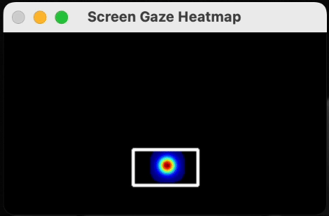

<!-- Improved compatibility of back to top link: See: https://github.com/othneildrew/Best-README-Template/pull/73 -->
<a id="readme-top"></a>
<!--
*** Thanks for checking out the Best-README-Template. If you have a suggestion
*** that would make this better, please fork the repo and create a pull request
*** or simply open an issue with the tag "enhancement".
*** Don't forget to give the project a star!
*** Thanks again! Now go create something AMAZING! :D
-->

<!-- PROJECT SHIELDS -->
<!--
*** I'm using markdown "reference style" links for readability.
*** Reference links are enclosed in brackets [ ] instead of parentheses ( ).
*** See the bottom of this document for the declaration of the reference variables
*** for contributors-url, forks-url, etc. This is an optional, concise syntax you may use.
*** https://www.markdownguide.org/basic-syntax/#reference-style-links

-->
<!-- [![Contributors][contributors-shield]][contributors-url] -->
<!-- [![MIT License][license-shield]][license-url] -->

<!-- PROJECT LOGO --> 
<br /> 
<div align="center"> 
  <a href="https://github.com/whoissegun/engagement_analysis"> 
     
  </a> 
  <h3 align="center">Lokdin: Engagement Detection Tool Using Computer Vision</h3> 
  <p align="center">
    Lokdin is a real-time engagement detection tool that can be utilized for various levels of analysis across multiple domains, including education, driving, healthcare, and corporate productivity. It leverages computer vision techniques to classify human engagement levels, providing actionable insights to enhance performance, safety, and efficiency.
    <br />
    <strong>Lokdin won 3rd place overall at the prestigious <a href="https://cuhacking.com">CUHacking Hackathon</a>!</strong>
  </p>
    <!-- <a href="https://github.com/your_username/lokdin">
      <strong>Explore the docs »</strong>
    </a> -->
    <br /> 
    <a href="assets/DEMO.mov">View Demo</a> · <a href="https://github.com/whoissegun/engagement_analysis/issues">Report Bug</a> · 
    <a href="https://github.com/whoissegun/engagement_analysis/issues">Request Feature</a> 
  </p> 
</div> 

<!-- TABLE OF CONTENTS --> 
<details> 
  <summary>Table of Contents</summary> 
    <ol> 
      <li>
        <a href="#about-lokdin">About Lokdin</a>
        <ul> 
          <li><a href="#built-with">Built With</a></li> 
        </ul> 
      </li> 
      <li>
        <a href="#target-use-cases">Target Use Cases</a>
      </li>
      <li>
        <a href="#mediapipe-landmarks">MediaPipe Landmarks
        </a>
      </li>
      <li>
        <a href="#key-algorithms">Key Algorithms</a>
      </li> 
      <li>
        <a href="#machine-learning-overview">Machine Learning Overview
        </a>
      </li>
      <li>
        <a href="#challenges-and-mitigation">Challenges and Mitigation</a>
      </li> 
      <li> 
        <a href="#getting-started">Getting Started</a> 
        <ul> 
          <li><a href="#prerequisites">Prerequisites</a></li> 
          <li><a href="#installation">Installation</a></li> 
        </ul> 
      </li> 
      <li>
        <a href="#usage">Usage</a>
        <ul> 
          <li><a href="#live-demo">Live Demo</a></li> 
          <li><a href="#visualization-and-heatmap">Visualization and Heatmap</a></li> 
        </ul> 
      </li> 
      <li>
        <a href="#contributing">Contributing</a>
      </li> 
      <li>
        <a href="#license">License</a>
      </li> 
      <li>
        <a href="#acknowledgments">Acknowledgments</a>
      </li> 
  </ol> 
</details>


<!-- ABOUT THE PROJECT -->
## About Lokdin

Lokdin is a real-time engagement detection tool designed to provide actionable insights across various industries. By leveraging computer vision techniques, it helps in enhancing productivity, safety, and efficiency.

<p align="right">(<a href="#readme-top">back to top</a>)</p>

### Built With
[](https://www.python.org/)
[](https://www.typescriptlang.org/)
[](https://reactjs.org/)
[](https://www.tensorflow.org/)

* OpenCV
* MediaPipe
* NumPy
* Keras

<p align="right">(<a href="#readme-top">back to top</a>)</p>

<!-- TARGET USE CASES -->
## Target Use Cases

Lokdin offers solutions tailored to the needs of various industries:

### Education (E-Learning Platforms)

- **Problem**: Educators struggle to monitor student engagement in virtual classrooms.
- **Solution**: Real-time monitoring of student attention, enabling teachers to adjust their teaching strategies.
- **Output**: Alerts for disengagement, analytics on participation trends.

### Corporate Training & Meetings

- **Problem**: Inefficiency in assessing employee attention during remote meetings or training.
- **Solution**: Integration into platforms like Microsoft Teams or Zoom for engagement tracking during sessions.
- **Output**: Post-meeting engagement reports and real-time feedback.

### Driver Monitoring Systems

- **Problem**: Distracted or drowsy driving leads to accidents.
- **Solution**: In-car systems detect fatigue and distraction, triggering alerts for safety.
- **Output**: Alerts for "Drowsy," "Distracted," or "Alert and Engaged."

### Healthcare and Therapy

- **Problem**: Difficulty in assessing patient engagement during telehealth or therapy sessions.
- **Solution**: Real-time feedback for healthcare providers on patient attention and emotional distress.
- **Output**: Metrics like "Engaged," "Distressed," or "Passive Listening."

### Entertainment and Media

- **Problem**: Need for feedback on audience engagement during content creation or testing.
- **Solution**: Engagement analytics for audience reactions during ads, movies, or games.
- **Output**: Insights into which segments capture or lose attention.

<p align="right">(<a href="#readme-top">back to top</a>)</p>

<!-- IMPORTANT LANDMARKS -->
## Mediapipe Landmarks

Lokdin leverages MediaPipe's **Facial Landmark Detection** model to analyze engagement-related features in real-time. The model detects 468 unique landmarks on the face, which are used for calculating various metrics such as head pose, gaze, and mouth aspect ratio.

Below are the key landmarks utilized in Lokdin:

### Key Facial Landmarks
- **Nose Tip**: Landmark `1` – Used for head pose estimation.
- **Chin**: Landmark `152` – Determines vertical head position for pose estimation.
- **Left Eye Outer Corner**: Landmark `33` – Aids in gaze tracking and blink detection.
- **Right Eye Outer Corner**: Landmark `263` – Complements gaze and blink calculations.
- **Left Mouth Corner**: Landmark `61` – Used for yawning detection via mouth aspect ratio.
- **Right Mouth Corner**: Landmark `291` – Completes mouth aspect ratio calculations.
- **Left Iris Center**: Landmark `468` – Central point for gaze tracking.
- **Right Iris Center**: Landmark `473` – Central point for gaze tracking.

### Eye-Specific Landmarks for Blink Detection
- **Left Eye Points**: `[33, 160, 158, 133, 153, 144]`
- **Right Eye Points**: `[362, 385, 387, 263, 373, 380]`

### Mouth-Specific Landmarks for Yawn Detection
- **Top Lip Points**: Landmarks `13` and `14`
- **Bottom Lip Points**: Landmarks `17` and `18`

### Visualization
To better understand the positioning of these landmarks, refer to the following annotated image showing all 468 landmarks from MediaPipe's facial detection model:

<div align="center"> 
  <a href="https://mediapipe-studio.webapps.google.com/home"> 
     
  </a> 
</div>

This visualization helps illustrate how these landmarks are mapped onto a user's face for real-time engagement analysis. 

<br>

<p align="right">(<a href="#readme-top">back to top</a>)</p>

<!-- KEY ALGORITHMS -->
## Key Algorithms

Lokdin utilizes a variety of custom algorithms to calculate engagement metrics in real time. Below are the key algorithms implemented:

### Gaze Calculation with Iris Detection

**Function**: `calculate_gaze_with_iris`  
This function calculates gaze direction based on iris position relative to the boundaries of the eyes.  

- **Inputs**:  
  - Landmarks from MediaPipe's face detection.  
  - Frame dimensions for scaling.  

- **Outputs**:  
  - Horizontal (`gaze_x`) and vertical (`gaze_y`) normalized gaze coordinates.  

- **Details**:  
  - Compensates for camera placement biases (e.g., top, center, bottom).  
  - Applies thresholds to map gaze to a normalized range of `[0, 1]`.

---

### Gaze Variation

**Function**: `calculate_gaze_variation`  
This function calculates variations in gaze direction over a buffer of recent gaze points.

- **Inputs**:  
  - Buffers of gaze positions (`gaze_positions_x`, `gaze_positions_y`).  

- **Outputs**:  
  - Standard deviations in horizontal and vertical gaze directions.  

---

### Eye Contact Detection

**Function**: `calculate_eye_contact`  
Determines whether the user is maintaining eye contact with the screen.

- **Inputs**:  
  - Gaze coordinates (`gaze_x`, `gaze_y`).  
  - Configurable thresholds for horizontal and vertical deviation.  

- **Outputs**:  
  - Boolean indicating if the user is maintaining eye contact.  

---

### Blink Detection

**Function**: `calculate_blinking_ratio`  
Calculates the blinking ratio based on the aspect ratio of the eyes.

- **Inputs**:  
  - Eye landmarks (e.g., `LEFT_EYE_POINTS`, `RIGHT_EYE_POINTS`).  

- **Outputs**:  
  - Blinking ratio.  

- **Details**:  
  - Compares eye width to height to determine if a blink occurred.  

---

### Head Pose Estimation

**Function**: `calculate_head_pose`  
Estimates head pose using 3D-2D mapping of facial landmarks.

- **Inputs**:  
  - Landmarks and frame dimensions.  

- **Outputs**:  
  - Head pitch, yaw, and roll (degrees).  

- **Details**:  
  - Normalizes angles for intuitive vertical, horizontal, and tilt movements.  

---

### Yawning Detection

**Function**: `calculate_mouth_aspect_ratio`  
Detects yawning based on the Mouth Aspect Ratio (MAR).

- **Inputs**:  
  - Lip landmarks and frame dimensions.  

- **Outputs**:  
  - MAR score.  

- **Details**:  
  - Compares vertical lip distances to horizontal mouth width.  

---

### Stability Calculation

**Function**: `calculate_stability`  
Measures the stability of facial landmarks across consecutive frames.

- **Inputs**:  
  - Current and previous landmarks.  
  - Frame dimensions.  

- **Outputs**:  
  - Stability score between `0` and `1`.  

---

### Event Timing

**Function**: `time_since_last_event`  
Tracks the time elapsed since a given event (e.g., head movement or gaze shift).

- **Inputs**:  
  - Timestamp of the last event.  

- **Outputs**:  
  - Time elapsed (seconds).  

---

### Eye Contact Buffer

**Class**: `EyeContactBuffer`  
Tracks eye contact and distraction durations.

- **Methods**:  
  - `update_eye_contact`: Updates eye contact status and durations.  

- **Outputs**:  
  - Boolean indicating if eye contact is detected.  
  - Eye contact and distraction durations.  

<p align="right">(<a href="#readme-top">back to top</a>)</p>


<!-- MACHINE LEARNING OVERVIEW -->
## Machine Learning Overview

Lokdin leverages a custom-built machine learning model for real-time engagement detection, designed to provide accurate predictions across various engagement levels: **Low**, **Medium**, and **High**. Below is an overview of the development process:

### Problem Statement

Lokdin tackles the challenge of predicting user engagement levels based on facial and gaze-based features. By analyzing behavioral and facial input data, Lokdin offers actionable insights tailored to diverse domains, including education, driving, and telehealth.

### Dataset Generation

To address the scarcity of engagement datasets, Lokdin uses a synthetic dataset simulating real-world engagement scenarios. The dataset includes:

- **Head Pose**: Pitch, yaw, and roll representing head orientation.
- **Gaze Coordinates**: Horizontal and vertical gaze positions (X, Y).
- **Eye Contact Duration**: Measuring how long a user maintains eye contact.
- **Gaze Variation**: Quantifying deviations in gaze direction over time.
- **Facial Confidence**: A measure of facial recognition confidence.
- **Landmark Stability**: Evaluating the consistency of facial landmarks.
- **Time Metrics**: Time since the last head movement or gaze shift.

The dataset was balanced to mitigate class imbalance and ensure equal representation across all engagement levels.

### Model Architecture

Lokdin employs a custom neural network architecture, developed with **PyTorch**, to classify engagement levels. The model’s architecture includes:

- **Input Layer**:
  - Features are normalized using **batch normalization** to enhance training stability.

- **Hidden Layers**:
  - Two fully connected layers with:
    - **Batch Normalization**: Ensures consistent feature scaling.
    - **LeakyReLU Activation**: Handles negative feature values effectively.
    - **Dropout Regularization**: Reduces overfitting with a 30% dropout rate.

- **Output Layer**:
  - A softmax activation function predicts the probability distribution across the engagement classes (**Low**, **Medium**, **High**).

**Key Features**:
- **Weight Initialization**: Kaiming Normal initialization ensures proper scaling.
- **Dropout**: Enhances generalization by mitigating overfitting.

### Training Pipeline

Lokdin’s training process is optimized for performance and efficiency:

- **Loss Function**: 
  - Cross-entropy loss, tailored for multi-class classification problems.
- **Optimizer**: 
  - AdamW optimizer with weight decay for efficient convergence.
- **Learning Rate Scheduler**: 
  - ReduceLROnPlateau dynamically adjusts the learning rate based on validation accuracy.
- **Gradient Clipping**: 
  - Caps gradients to a maximum norm of 1.0 to prevent exploding gradients.

### Training Process

Lokdin’s training and validation processes included:

- **Batch Processing**: 
  - Data is processed in batches for memory efficiency.
- **Early Stopping**: 
  - Training halts after 5 consecutive epochs without improvement to prevent overfitting.
- **Performance Monitoring**: 
  - Accuracy and loss are logged across epochs for both training and validation phases.

### Results

The model achieved high validation accuracy, ensuring robust performance across diverse scenarios. The best-performing model, determined during training, is deployed for real-time engagement detection.

### Data Structure Sent to the Model

Lokdin encapsulates extracted engagement metrics within a structured `FaceFeatures` data class. These features are used as inputs to the machine learning model:

```python
@dataclass
class FaceFeatures:
    head_pitch: float  # Vertical head movement
    head_yaw: float  # Horizontal head movement
    head_roll: float  # Rotational head movement
    gaze_x: float  # Horizontal gaze position
    gaze_y: float  # Vertical gaze position
    eye_contact_duration: float  # Time spent maintaining eye contact
    gaze_variation_x: float  # Gaze variability in horizontal direction
    gaze_variation_y: float  # Gaze variability in vertical direction
    face_confidence: float  # Confidence score of face detection
    landmarks_stability: float  # Stability of face landmarks
    time_since_head_movement: float  # Time since last significant head movement
    time_since_gaze_shift: float  # Time since last significant gaze shift
    mar: float  # Mouth Aspect Ratio, used for yawning detection
    blink_ratio: float  # Blink ratio for detecting blinks
    is_blinking: bool  # Boolean flag for blink detection
    is_focused: bool  # Boolean flag for determining focus
    distraction_duration: float  # Duration of distraction
    eye_contact_detected: bool  # Boolean flag for detecting eye contact
    yawn_detected: bool  # Boolean flag for detecting yawns
  ```


<p align="right">(<a href="#readme-top">back to top</a>)</p>


<!-- CHALLENGES AND MITIGATION -->
## Challenges and Mitigation

### Challenges

1. **Data Privacy**: Ensuring compliance with GDPR and similar regulations.
2. **Data Scarcity**: Limited datasets for engagement classification.
3. **Model Bias**: Avoiding demographic bias in predictions.

### Mitigation Strategies

- Implement local processing for privacy-critical applications.
- Regular audits for model fairness.
- Diverse data collection strategies to ensure inclusivity.

<p align="right">(<a href="#readme-top">back to top</a>)</p>

<!-- GETTING STARTED -->
## Getting Started

This is an example of how you may give instructions on setting up your project locally.
To get a local copy up and running follow these simple example steps.

### Prerequisites
Ensure you have the following installed:

- Python 3.7 or higher
- OpenCV
- MediaPipe
- NumPy
- TensorFlow
- Keras

### Installation

1. Clone the repo
   ```sh
   git clone https://github.com/whoissegun/engagement_analysis.git
   ```
2. Navigate to Directoy
   ```sh
   cd engagement_analysis
   ```
3. Download all dependencies using pip or pip3 (MAC)
   ```sh
   pip3 install -r requirements.txt
   ```
4. Navigate to backend/processing
  ```sh
   cd backend/processing/
   ```
5. 1 For the visualization including the faceMesh overlay
  ```sh
   python3 main_processor.py
   ```
5. 2 For the heatMap
  ```sh
   python3 heatmap.py
   ```
6. click 'q' key to close the window and terminate the application

<p align="right">(<a href="#readme-top">back to top</a>)</p>


<!-- USAGE EXAMPLES -->
## Usage

### Live Demo
Click the image below for a live demo of Lokdin in action:
<a href="https://github.com/whoissegun/engagement_analysis"> 
     
</a>

### Visualization and Heatmap
Lokdin includes a heatmap feature to provide a comprehensive visualization of engagement metrics over time. Click the image below to view the heatmap in action:
<a href="https://github.com/whoissegun/engagement_analysis"> 
     
</a>

<p align="right">(<a href="#readme-top">back to top</a>)</p>


<!-- CONTRIBUTING -->
## Contributing

Contributions are what make the open source community such an amazing place to learn, inspire, and create. Any contributions you make are **greatly appreciated**.

If you have a suggestion that would make this better, please fork the repo and create a pull request. You can also simply open an issue with the tag "enhancement".
Don't forget to give the project a star! Thanks again!

1. Fork the Project
2. Create your Feature Branch (`git checkout -b feature/AmazingFeature`)
3. Commit your Changes (`git commit -m 'Add some AmazingFeature'`)
4. Push to the Branch (`git push origin feature/AmazingFeature`)
5. Open a Pull Request

<p align="right">(<a href="#readme-top">back to top</a>)</p>


<!-- LICENSE -->
## License

Distributed under the MIT License. See `LICENSE.txt` for more information.

<p align="right">(<a href="#readme-top">back to top</a>)</p>

<!-- ACKNOWLEDGMENTS -->
## Acknowledgments

Special thanks to the following for their contributions and support:

* **CUHacking Hackathon** - For providing the platform where Lokdin was conceptualized and developed. [CUHacking](https://cuhacking.ca)
* [OpenCV](https://opencv.org/) - For enabling efficient computer vision processing.
* [Mediapipe](https://mediapipe.dev/) - For providing the facial landmark detection model.
* **Team Lokdin** - For the collaborative effort that made this project a success.

<p align="right">(<a href="#readme-top">back to top</a>)</p>


<p align="right">(<a href="#readme-top">back to top</a>)</p>


<!-- MARKDOWN LINKS & IMAGES -->
<!-- https://www.markdownguide.org/basic-syntax/#reference-style-links -->
[contributors-shield]: https://img.shields.io/github/contributors/github_username/repo_name.svg?style=for-the-badge
[contributors-url]: https://github.com/github_username/repo_name/graphs/contributors
[forks-shield]: https://img.shields.io/github/forks/github_username/repo_name.svg?style=for-the-badge
[forks-url]: https://github.com/github_username/repo_name/network/members
[stars-shield]: https://img.shields.io/github/stars/github_username/repo_name.svg?style=for-the-badge
[stars-url]: https://github.com/github_username/repo_name/stargazers
[issues-shield]: https://img.shields.io/github/issues/github_username/repo_name.svg?style=for-the-badge
[issues-url]: https://github.com/github_username/repo_name/issues
[license-shield]: https://img.shields.io/github/license/github_username/repo_name.svg?style=for-the-badge
[license-url]: https://github.com/whoissegun/engagement_analysis/blob/main/LICENSE
[linkedin-shield]: https://img.shields.io/badge/-LinkedIn-black.svg?style=for-the-badge&logo=linkedin&colorB=555
[linkedin-url]: https://linkedin.com/in/linkedin_username
[product-screenshot]: images/screenshot.png
[Next.js]: https://img.shields.io/badge/next.js-000000?style=for-the-badge&logo=nextdotjs&logoColor=white
[Next-url]: https://nextjs.org/
[React.js]: https://img.shields.io/badge/React-20232A?style=for-the-badge&logo=react&logoColor=61DAFB
[React-url]: https://reactjs.org/
[Vue.js]: https://img.shields.io/badge/Vue.js-35495E?style=for-the-badge&logo=vuedotjs&logoColor=4FC08D
[Vue-url]: https://vuejs.org/
[Angular.io]: https://img.shields.io/badge/Angular-DD0031?style=for-the-badge&logo=angular&logoColor=white
[Angular-url]: https://angular.io/
[Svelte.dev]: https://img.shields.io/badge/Svelte-4A4A55?style=for-the-badge&logo=svelte&logoColor=FF3E00
[Svelte-url]: https://svelte.dev/
[Laravel.com]: https://img.shields.io/badge/Laravel-FF2D20?style=for-the-badge&logo=laravel&logoColor=white
[Laravel-url]: https://laravel.com
[Bootstrap.com]: https://img.shields.io/badge/Bootstrap-563D7C?style=for-the-badge&logo=bootstrap&logoColor=white
[Bootstrap-url]: https://getbootstrap.com
[JQuery.com]: https://img.shields.io/badge/jQuery-0769AD?style=for-the-badge&logo=jquery&logoColor=white
[JQuery-url]: https://jquery.com 
